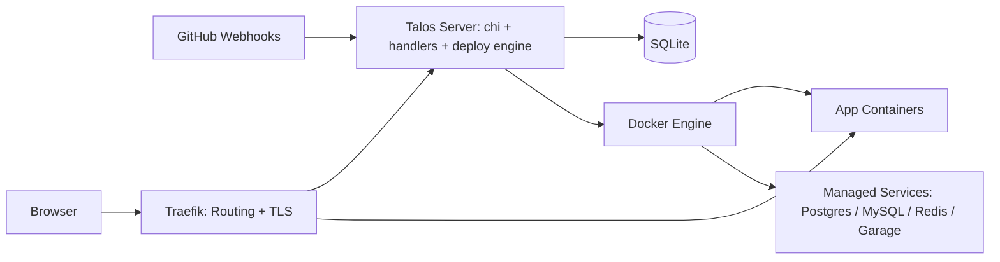

# Talos

Self-hosted deployment platform for Dockerized applications on a single VPS.

## Quick Start

```bash
git clone https://github.com/logic-roastery/project-talos.git
cd project-talos
cp .env.example .env
# Edit .env — at minimum set TALOS_SESSION_SECRET
make build
./bin/talos
```

Open `http://your-vps-ip:3000` and create your admin account.

## Install

One-line install on a fresh Linux VPS (Ubuntu/Debian/Fedora):

```bash
curl -sSL https://raw.githubusercontent.com/logic-roastery/project-talos/master/scripts/install.sh | sudo sh
```

This installs Talos as a bare binary with a systemd service. Docker is installed automatically if missing.

For Docker mode (container-based, easier upgrades):

```bash
curl -sSL https://raw.githubusercontent.com/logic-roastery/project-talos/master/scripts/install.sh | sudo sh -s -- --docker
```

After install, open `http://<your-server-ip>:3000` and create your admin account.

## Domain Setup

The installer will ask if you have a domain. You have two options:

**IP mode** (default) — access at `http://<your-vps-ip>:3000`. No domain needed.

**Domain mode** — access at `https://talos.example.com` with automatic HTTPS via Let's Encrypt.
Point your domain's DNS A record at your VPS IP, then set:

```
TALOS_DOMAIN=talos.example.com
TALOS_ACME_EMAIL=admin@example.com
```

Talos will start Traefik with auto-TLS and redirect HTTP to HTTPS automatically.

## Configuration

All configuration is via environment variables. Copy `.env.example` to `.env` and edit.

| Variable | Default | Description |
|----------|---------|-------------|
| `TALOS_HOST` | `0.0.0.0` | Listen address |
| `TALOS_PORT` | `3000` | Listen port |
| `TALOS_DOMAIN` | *(empty)* | Domain name (enables HTTPS via Let's Encrypt) |
| `TALOS_ACME_EMAIL` | *(empty)* | Email for Let's Encrypt certificate notifications |
| `TALOS_DB_PATH` | `data/talos.db` | SQLite database path |
| `TALOS_SESSION_SECRET` | **required** | HMAC signing secret for sessions |
| `TALOS_SESSION_MAX_AGE` | `604800` | Session lifetime in seconds (7 days) |
| `TALOS_DOCKER_HOST` | `unix:///var/run/docker.sock` | Docker daemon socket |
| `TALOS_DOCKER_NETWORK` | `talos` | Docker network name for containers |
| `TALOS_ENCRYPTION_KEY` | auto-generated | Base64 AES-256 key for credential encryption |
| `TALOS_TRAEFIK_IMAGE` | `traefik:v3.0` | Traefik reverse proxy image |
| `TALOS_TRAEFIK_DASHBOARD` | `false` | Enable Traefik dashboard |
| `TALOS_BACKUP_DIR` | `data/backups` | Directory for backup files |
| `TALOS_BACKUP_INTERVAL_MINUTES` | `0` | Scheduled backup interval (0 = disabled) |
| `TALOS_BACKUP_RETAIN_COUNT` | `10` | Number of backups to retain |

### GitHub App (optional)

Set these to enable automatic deployments from GitHub pushes:

| Variable | Description |
|----------|-------------|
| `TALOS_GITHUB_WEBHOOK_SECRET` | Webhook verification secret |
| `TALOS_GITHUB_APP_ID` | GitHub App ID |
| `TALOS_GITHUB_APP_SLUG` | GitHub App slug |
| `TALOS_GITHUB_APP_PRIVATE_KEY` | Path or contents of private key |
| `TALOS_GITHUB_APP_CLIENT_ID` | OAuth client ID |
| `TALOS_GITHUB_APP_CLIENT_SECRET` | OAuth client secret |

Or use the setup wizard at `/settings/github/setup`.

## Architecture



Talos acts as the control plane for a single VPS. It provides the web UI, stores state in SQLite, talks to the Docker Engine to create and manage workloads, and configures Traefik to route public traffic to deployed applications.

### Components

| Component | Responsibility |
|----------|----------------|
| Browser | UI for managing apps, services, deployments, and settings |
| Talos Server | Authentication, app/service management, blue/green deployment orchestration, backup, GitHub integration |
| SQLite | Persistent storage for users, apps, services, deployments, deploy events, backups, and configuration |
| Docker Engine | Runs application containers and managed backing services |
| Traefik | Public entrypoint, reverse proxy, domain routing, and automatic TLS |
| GitHub Webhooks | Trigger deployments from repository events |

## How Talos Works

Talos is a single-server deployment control plane. It is not a container orchestrator in the Kubernetes sense, and it does not manage a multi-node cluster. Its job is to keep a small amount of desired state in SQLite, translate that state into Docker operations, and keep public routing aligned through Traefik.

### Control Plane vs Runtime

- **Control plane**: Talos server, SQLite, GitHub integration, deployment records, service definitions, and routing decisions
- **Runtime plane**: Docker containers, Docker network, container images, persistent service volumes, and Traefik as the public ingress

This split is important:

- SQLite stores what Talos knows about apps, services, users, and deploy history
- Docker is the source of truth for running containers and attached volumes
- Traefik is responsible for receiving public traffic and forwarding it to the correct application container

If Talos restarts, running containers can continue serving traffic. Talos is needed to create, update, stop, or re-route workloads, but it is not the same thing as the workloads themselves.

### App Lifecycle

When you create an app in the UI, Talos stores its metadata in SQLite: image reference, internal port, environment variables, linked services, and deployment history. A deploy can then be triggered manually or by a GitHub webhook.

At deploy time, Talos performs a **blue/green deployment**:

1. Creates a deploy record in SQLite
2. Validates required environment variables
3. Captures an environment variable snapshot for diff tracking
4. Pulls the target container image from the registry
5. Starts a **staging container** alongside the currently live one
6. Waits for the staging container to pass its health check (30s timeout)
7. If the health check **passes**: switches the Traefik route to the staging container, then stops the old one
8. If the health check **fails**: stops the staging container and leaves the old one running (automatic rollback)
9. Records structured deploy events at each step for diagnostics

This means the old container is never stopped until the new one is proven healthy. A failed deploy does not cause downtime.

### Managed Services

Managed services such as PostgreSQL, MySQL, Redis, and Garage are also regular Docker containers. Talos provisions them, creates persistent storage directories, generates credentials, encrypts those credentials before saving them, and injects connection environment variables into linked apps during deployment.

Each service has:

- A record in SQLite
- A Talos-managed Docker container
- A persistent data directory or volume path on the host
- Generated credentials encrypted at rest

Talos does not implement these databases itself. It standardizes how they are created, stored, linked, and restarted.

### Persistence Model

Talos spans three layers of persistence and state:

- **SQLite**: users, sessions, apps, services, deploy metadata, deploy events, env var history, backups, GitHub integration settings
- **Docker**: container state, images, networks, container health, service runtime configuration
- **Host filesystem**: SQLite database file, service data directories, backup archives, local runtime artifacts

This is also the practical backup boundary. Talos has built-in backup support (`POST /api/backups`) that snapshots SQLite and service volumes into a single archive. Alternatively, you can back up manually:

- Back up SQLite to preserve Talos metadata
- Back up service data directories or Docker volumes to preserve database contents
- Rebuild containers from image references when restoring runtime state

### Codebase Map

The main packages are organized around control-plane responsibilities:

- `cmd/talos`: application entrypoint
- `internal/server`: HTTP server, middleware, HTML handlers, and web endpoints
- `internal/store`: SQLite persistence, repositories, and schema migrations
- `internal/deploy`: deployment orchestration with blue/green flow and rollback
- `internal/backup`: backup scheduling, creation (VACUUM INTO + tar.gz), and restore
- `internal/runtime/docker`: Docker API wrapper used to pull images and manage containers
- `internal/services`: managed service provisioning, credential handling, and service lifecycle
- `internal/proxy/traefik`: routing and reverse-proxy integration
- `internal/github`: GitHub App auth, webhook verification, and workflow-related integration
- `internal/auth` and `internal/crypto`: authentication, password handling, and encryption primitives
- `web/templates`: server-rendered UI templates

### Current Constraints

Talos is intentionally small and opinionated. Current design constraints include:

- Single VPS deployment model
- Docker runtime only
- SQLite as the control-plane database
- No cluster scheduler or multi-node placement
- Traefik as the built-in ingress path for domain-based routing

These constraints keep the system understandable and easy to self-host, but they also define the current product boundary.

### Safe Releases

Talos uses blue/green deploys with automatic rollback. During a deploy, a new staging container starts alongside the live one. The old container is only stopped after the new one passes its health check and the Traefik route is switched. If the health check fails, the staging container is destroyed and the old one continues serving traffic with zero downtime.

Every deploy step emits structured events (pull, start, health check, route update, finalize) that are stored in SQLite and visible in the UI. Failed deploys show exactly where and why they failed.

### Environment Management

Apps can define environment variables with the following capabilities:

- **Required vars**: Mark variables as required — deploys fail if they are missing
- **Secret masking**: Secret values are masked in the UI and API responses
- **Change history**: Every env var change is recorded with a timestamp
- **Deploy snapshots**: Each deploy captures a snapshot of env vars at deploy time for diff visibility
- **Reveal**: Authenticated users can reveal secret values via a dedicated endpoint

### Backup and Restore

Talos includes built-in backup and restore:

- **Full backup**: Snapshots the SQLite database (via `VACUUM INTO`) and service data volumes into a single tar.gz
- **Scheduled backups**: Configure `TALOS_BACKUP_INTERVAL_MINUTES` for automatic periodic backups
- **Retention policy**: Configurable via `TALOS_BACKUP_RETAIN_COUNT` (default: keep last 10)
- **Restore**: Restores the database and volumes from a backup (requires process restart)

Backup API endpoints: `GET /api/backups`, `POST /api/backups`, `DELETE /api/backups/{id}`, `POST /api/backups/{id}/restore`

### Deployment Flow

1. A user creates an app in Talos and configures its repository, image, or deployment settings.
2. Talos stores the app state and deployment metadata in SQLite.
3. A manual deploy or GitHub webhook triggers the deployment pipeline.
4. Talos validates required env vars, then starts a staging container alongside the live one.
5. The staging container is health-checked. If it passes, Traefik routes traffic to it and the old container is stopped.
6. If the health check fails, the staging container is removed and the old one keeps running.
7. Structured deploy events are recorded at each step for diagnostics.

## Development

```bash
make dev          # Start dev server on port 4001
make dev-watch    # Auto-reload with air
make dev-fresh    # Reset DB and restart
make test         # Run tests with race detection
make test-cover   # Tests with HTML coverage report
make vet          # Static analysis
make ps           # List Talos-managed containers
```

## Managed Services

Talos can provision and manage backing services:

| Type | Image | Default Port |
|------|-------|-------------|
| PostgreSQL | `postgres:16` | 5432 |
| MySQL | `mysql:8` | 3306 |
| Redis | `redis:7-alpine` | 6379 |
| Garage | `dxflrs/garage:v1.0` | 3900 |

Services run as Docker containers managed by Talos. Credentials are encrypted at rest with AES-256-GCM.

## Docker

```bash
docker run -d \
  -p 3000:3000 \
  -v /var/run/docker.sock:/var/run/docker.sock \
  -v talos-data:/data \
  --env-file .env \
  ghcr.io/logic-roastery/project-talos:latest
```

## License

See [LICENSE](LICENSE).
