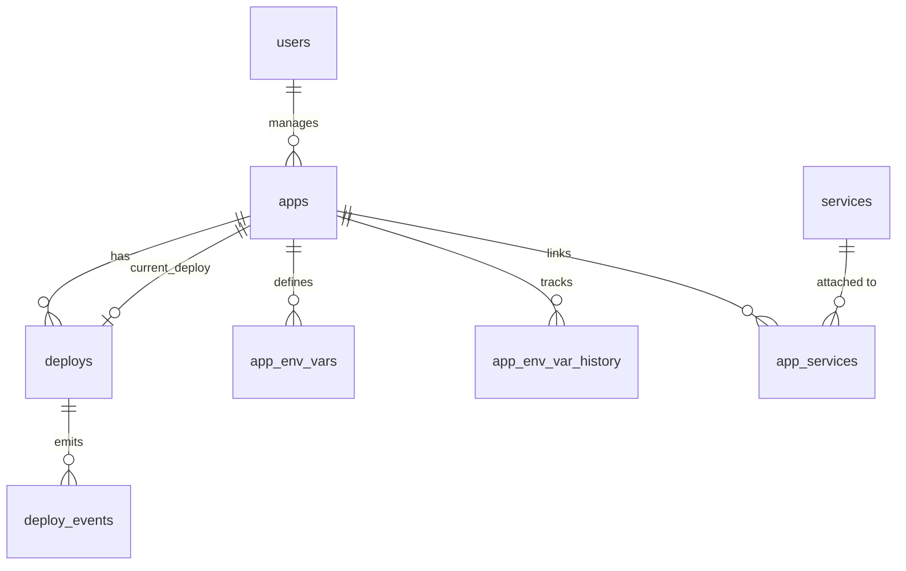

# Data Model

Talos stores all metadata in a SQLite database. This page documents the schema for each table.

## Entity Relationship

## Tables

### users

Stores admin accounts for the Talos web UI.

| Column | Type | Constraints | Description |
|--------|------|-------------|-------------|
| `id` | INTEGER | PRIMARY KEY AUTOINCREMENT | Unique user ID |
| `username` | TEXT | NOT NULL UNIQUE | Login username |
| `password_hash` | TEXT | NOT NULL | Bcrypt password hash |
| `created_at` | DATETIME | NOT NULL DEFAULT CURRENT_TIMESTAMP | Account creation time |
| `updated_at` | DATETIME | NOT NULL DEFAULT CURRENT_TIMESTAMP | Last update time |

### apps

Stores application definitions and current state.

| Column | Type | Constraints | Description |
|--------|------|-------------|-------------|
| `id` | INTEGER | PRIMARY KEY AUTOINCREMENT | Unique app ID |
| `name` | TEXT | NOT NULL UNIQUE | Application name (used in container names and URLs) |
| `source` | TEXT | NOT NULL DEFAULT 'github' | Source type |
| `repo_url` | TEXT | NOT NULL | Git repository URL |
| `branch` | TEXT | NOT NULL DEFAULT 'main' | Default branch |
| `project_type` | TEXT | NOT NULL DEFAULT '' | Build detection override: `static`, `node`, `go`, `java`, or `''` for auto-detect |
| `internal_port` | INTEGER | NOT NULL DEFAULT 3000 | Port the app listens on inside the container |
| `image_ref` | TEXT | NOT NULL DEFAULT '' | Current container image reference |
| `domain` | TEXT | DEFAULT '' | Custom domain (unique index, empty allowed) |
| `fallback_port` | INTEGER | DEFAULT 0 | External port for IP mode (unique index, 0 = not set) |
| `access_mode` | TEXT | NOT NULL DEFAULT 'port' | `domain` or `port` |
| `access_url` | TEXT | NOT NULL DEFAULT '' | Computed access URL |
| `status` | TEXT | NOT NULL DEFAULT 'inactive' | `active`, `inactive`, or `error` |
| `current_deploy_id` | INTEGER | REFERENCES deploys(id) | Currently live deploy |
| `live_container_name` | TEXT | NOT NULL DEFAULT '' | Name of the running container |
| `github_installation_id` | INTEGER | | GitHub App installation ID |
| `github_repo_id` | INTEGER | | GitHub repository ID |
| `registry_url` | TEXT | NOT NULL DEFAULT '' | Container registry URL (default: ghcr.io) |
| `created_at` | DATETIME | NOT NULL DEFAULT CURRENT_TIMESTAMP | Creation time |
| `updated_at` | DATETIME | NOT NULL DEFAULT CURRENT_TIMESTAMP | Last update time |

**Indexes:**

- `idx_apps_domain` -- UNIQUE on `domain` WHERE `domain != ''`
- `idx_apps_fallback_port` -- UNIQUE on `fallback_port` WHERE `fallback_port > 0`

**`project_type` behavior:**

- Empty string `''` (default) means Talos auto-detects the project type from sentinel files when no `Dockerfile` is present.
- A non-empty value (`static`, `node`, `go`, `java`) forces that provider, skipping auto-detection entirely.
- Only applies to **Talos Build** mode (`build_mode = 'talos_build'`). In **External CI** mode, this column is ignored.
- Existing rows default to `''` (auto-detect) — no migration needed for the new column.

### deploys

Records each deployment attempt.

| Column | Type | Constraints | Description |
|--------|------|-------------|-------------|
| `id` | INTEGER | PRIMARY KEY AUTOINCREMENT | Unique deploy ID |
| `app_id` | INTEGER | NOT NULL REFERENCES apps(id) ON DELETE CASCADE | Target application |
| `image_ref` | TEXT | NOT NULL | Container image deployed |
| `commit_sha` | TEXT | DEFAULT '' | Git commit SHA |
| `branch` | TEXT | NOT NULL | Git branch |
| `status` | TEXT | NOT NULL DEFAULT 'pending' | `pending`, `running`, `success`, `failed`, `rollback`, `auto_rollback` |
| `container_id` | TEXT | DEFAULT '' | Docker container ID |
| `health_status` | TEXT | DEFAULT '' | `healthy` or `unhealthy` |
| `logs` | TEXT | DEFAULT '' | Error message or deploy summary |
| `env_snapshot` | TEXT | NOT NULL DEFAULT '' | JSON snapshot of env vars at deploy time |
| `started_at` | DATETIME | | When execution started |
| `completed_at` | DATETIME | | When deploy finished (success or failure) |
| `triggered_by` | TEXT | NOT NULL DEFAULT 'webhook' | `webhook`, `manual`, or `rollback` |
| `rollback_of_id` | INTEGER | REFERENCES deploys(id) | If this is a rollback, the deploy it rolled back from |
| `created_at` | DATETIME | NOT NULL DEFAULT CURRENT_TIMESTAMP | Creation time |

**Indexes:**

- `idx_deploys_app_id` -- on `app_id`

### deploy_events

Structured events emitted during deployment for diagnostics.

| Column | Type | Constraints | Description |
|--------|------|-------------|-------------|
| `id` | INTEGER | PRIMARY KEY AUTOINCREMENT | Unique event ID |
| `deploy_id` | INTEGER | NOT NULL REFERENCES deploys(id) ON DELETE CASCADE | Parent deploy |
| `timestamp` | DATETIME | NOT NULL DEFAULT CURRENT_TIMESTAMP | When the event occurred |
| `level` | TEXT | NOT NULL DEFAULT 'info' | `info`, `warn`, or `error` |
| `step` | TEXT | NOT NULL DEFAULT '' | Pipeline step: `start`, `pull`, `health_check`, `route_update`, `stop_old`, `finalize`, `auto_rollback` |
| `message` | TEXT | NOT NULL DEFAULT '' | Human-readable event description |

**Indexes:**

- `idx_deploy_events_deploy_id` -- on `deploy_id`

### services

Managed backing services (databases, caches, storage).

| Column | Type | Constraints | Description |
|--------|------|-------------|-------------|
| `id` | INTEGER | PRIMARY KEY AUTOINCREMENT | Unique service ID |
| `name` | TEXT | NOT NULL UNIQUE | Service name |
| `type` | TEXT | NOT NULL | `postgres`, `mysql`, `redis`, or `garage` |
| `image_ref` | TEXT | NOT NULL | Docker image (e.g., `postgres:16`) |
| `status` | TEXT | NOT NULL DEFAULT 'pending' | `pending`, `provisioning`, `active`, `error`, `stopped` |
| `container_id` | TEXT | DEFAULT '' | Docker container ID |
| `app_id` | INTEGER | REFERENCES apps(id) ON DELETE SET NULL | Legacy direct app link |
| `volume_path` | TEXT | NOT NULL DEFAULT '' | Host path for persistent data |
| `credentials` | TEXT | NOT NULL DEFAULT '' | AES-256-GCM encrypted JSON credentials |
| `config` | TEXT | NOT NULL DEFAULT '{}' | Additional configuration JSON |
| `internal_port` | INTEGER | NOT NULL DEFAULT 0 | Service port (5432, 3306, 6379, 3900) |
| `created_at` | DATETIME | NOT NULL DEFAULT CURRENT_TIMESTAMP | Creation time |
| `updated_at` | DATETIME | NOT NULL DEFAULT CURRENT_TIMESTAMP | Last update time |

### app_services

Many-to-many link between apps and services, with an alias for env var injection.

| Column | Type | Constraints | Description |
|--------|------|-------------|-------------|
| `app_id` | INTEGER | NOT NULL REFERENCES apps(id) ON DELETE CASCADE | Application |
| `service_id` | INTEGER | NOT NULL REFERENCES services(id) ON DELETE CASCADE | Service |
| `alias` | TEXT | NOT NULL DEFAULT '' | Prefix for injected env vars |

**Primary Key:** `(app_id, service_id)`

### app_env_vars

Per-application environment variables.

| Column | Type | Constraints | Description |
|--------|------|-------------|-------------|
| `id` | INTEGER | PRIMARY KEY AUTOINCREMENT | Unique ID |
| `app_id` | INTEGER | NOT NULL REFERENCES apps(id) ON DELETE CASCADE | Application |
| `key` | TEXT | NOT NULL | Variable name |
| `value` | TEXT | NOT NULL DEFAULT '' | Variable value |
| `is_secret` | INTEGER | NOT NULL DEFAULT 0 | 1 if masked in UI |
| `required` | INTEGER | NOT NULL DEFAULT 0 | 1 if deploy fails when missing |

**Unique Constraint:** `(app_id, key)`

### app_env_var_history

Tracks previous values of environment variables for audit and diff.

| Column | Type | Constraints | Description |
|--------|------|-------------|-------------|
| `id` | INTEGER | PRIMARY KEY AUTOINCREMENT | Unique ID |
| `app_id` | INTEGER | NOT NULL REFERENCES apps(id) ON DELETE CASCADE | Application |
| `key` | TEXT | NOT NULL | Variable name |
| `value` | TEXT | NOT NULL DEFAULT '' | Previous value |
| `is_secret` | INTEGER | NOT NULL DEFAULT 0 | Was it a secret? |
| `changed_at` | DATETIME | NOT NULL DEFAULT CURRENT_TIMESTAMP | When the change occurred |
| `changed_by` | TEXT | NOT NULL DEFAULT 'system' | Who made the change |

**Indexes:**

- `idx_env_var_history_app_key` -- on `(app_id, key)`

### backups

Backup records and metadata.

| Column | Type | Constraints | Description |
|--------|------|-------------|-------------|
| `id` | INTEGER | PRIMARY KEY AUTOINCREMENT | Unique backup ID |
| `filename` | TEXT | NOT NULL | Backup file name (e.g., `talos-backup-20250101-120000.tar.gz`) |
| `size_bytes` | INTEGER | NOT NULL DEFAULT 0 | File size in bytes |
| `type` | TEXT | NOT NULL DEFAULT 'full' | Backup type |
| `status` | TEXT | NOT NULL DEFAULT 'completed' | Backup status |
| `created_at` | DATETIME | NOT NULL DEFAULT CURRENT_TIMESTAMP | Creation time |

### schema_migrations

Tracks applied database migrations.

| Column | Type | Constraints | Description |
|--------|------|-------------|-------------|
| `version` | INTEGER | PRIMARY KEY | Migration version number |
| `applied_at` | DATETIME | NOT NULL DEFAULT CURRENT_TIMESTAMP | When the migration was applied |

## Credential Encryption

Service credentials are encrypted at rest using AES-256-GCM. The encryption key is derived from `TALOS_ENCRYPTION_KEY` in the `.env` file. Each service type has a structured credential format:

| Service | Credential Fields |
|---------|------------------|
| PostgreSQL | host, port, database, user, password |
| MySQL | host, port, database, user, password |
| Redis | host, port, password |
| Garage | endpoint, region, access_key, secret_key, bucket |

Credentials are stored as encrypted JSON in the `services.credentials` column and decrypted only when needed for injection into app containers.

## Next Steps

- [Components](./components.md) -- how these tables are used by each component
- [Deployment Flow](./deployment-flow.md) -- how deploys and events relate
- [Architecture Overview](./index.md) -- system overview
