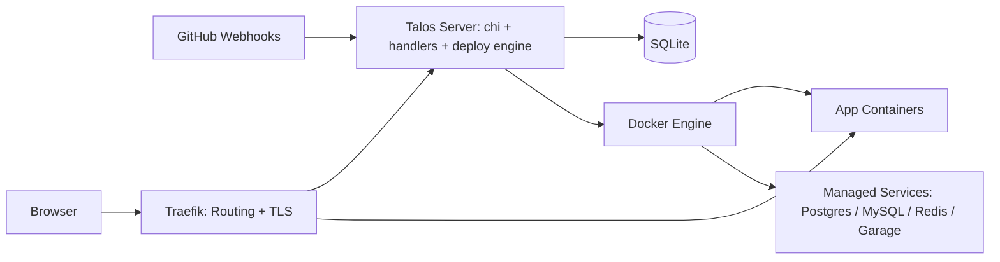

# Architecture Overview

Talos is a self-hosted deployment platform for Dockerized applications on a single VPS. It acts as the control plane that manages applications, services, routing, and deployments through a web UI and API.

## System Architecture

## How It Works

Talos separates **control plane** from **runtime plane**:

- **Control plane**: Talos server, SQLite database, GitHub integration, deployment records, service definitions, and routing decisions
- **Runtime plane**: Docker containers, Docker network, container images, persistent service volumes, and Traefik as the public ingress

This split means:

- SQLite stores what Talos knows about apps, services, users, and deploy history
- Docker is the source of truth for running containers and attached volumes
- Traefik receives public traffic and forwards it to the correct application container

If Talos restarts, running containers continue serving traffic. Talos is needed to create, update, stop, or re-route workloads, but it is not the workloads themselves.

## Components

| Component | Responsibility |
|-----------|----------------|
| **Browser** | Web UI for managing apps, services, deployments, and settings |
| **Talos Server** | Authentication, app/service management, blue/green deployment orchestration, backup, GitHub integration |
| **SQLite** | Persistent storage for users, apps, services, deployments, deploy events, backups, and configuration |
| **Docker Engine** | Runs application containers and managed backing services |
| **Traefik** | Public entrypoint, reverse proxy, domain routing, and automatic TLS via Let's Encrypt |
| **GitHub Webhooks** | Trigger deployments from repository events |

## Request Flow

### Web UI Access

1. A user opens the Talos web UI in their browser.
2. Requests pass through Traefik (if domain mode is configured) or go directly to the Talos server.
3. The Talos server (built with [chi router](https://github.com/go-chi/chi)) handles authentication, serves HTML pages, and processes API calls.
4. State changes are written to SQLite.
5. Docker operations (container create, stop, etc.) are executed via the Docker socket.

### Application Traffic

1. A user visits a deployed application's URL.
2. Traefik receives the request and matches it against configured routes.
3. Traefik forwards the request to the correct application container on the `talos` Docker network.
4. The application container processes the request and responds.

### Deployment Trigger

1. A GitHub webhook or manual action triggers a deploy.
2. Talos validates environment variables and pulls the container image.
3. A staging container starts alongside the live container.
4. The staging container is health-checked (30-second timeout).
5. On success, Traefik routes switch to the staging container and the old one is stopped.
6. On failure, the staging container is destroyed and the old one keeps running.

## Persistence Layers

Talos spans three persistence layers:

| Layer | Contents |
|-------|----------|
| **SQLite** | Users, sessions, apps, services, deploy metadata, deploy events, env var history, backups, GitHub settings |
| **Docker** | Container state, images, networks, container health, service runtime |
| **Host filesystem** | SQLite database file, service data directories, backup archives, Traefik configuration |

## Design Constraints

Talos is intentionally small and opinionated:

- Single VPS deployment model
- Docker runtime only
- SQLite as the control-plane database
- No cluster scheduler or multi-node placement
- Traefik as the built-in ingress for domain-based routing

These constraints keep the system understandable and easy to self-host.

## Next Steps

- [Components](./components.md) -- detailed component descriptions
- [Deployment Flow](./deployment-flow.md) -- blue/green deployment in detail
- [Data Model](./data-model.md) -- database schema reference
